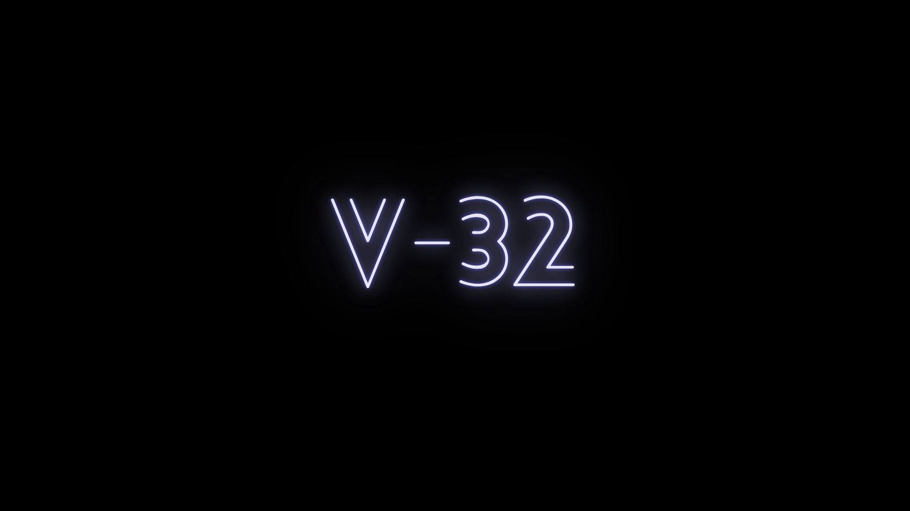

  

========================================================================================

<h1>Sobre Mim:</h1>

Criador amador de páginas web. Meu objetivo é desenvolver projetos e testar as minhas habilidades que eu aprendi durante o caminho...

<h1 align="center">Linguagens usadas</h1>
  

 
 

